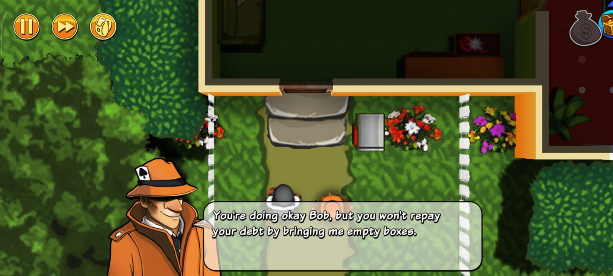
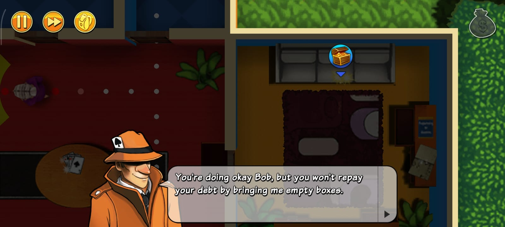
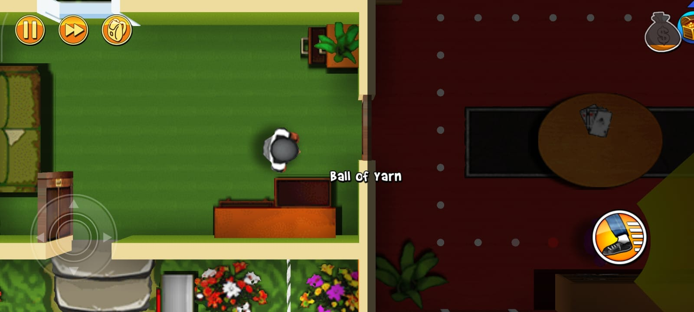
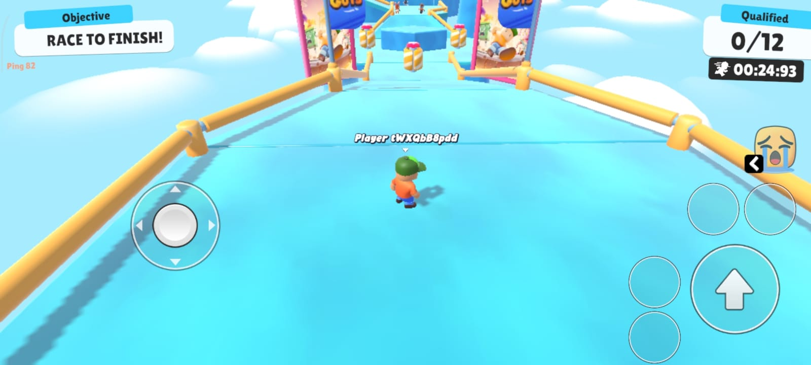
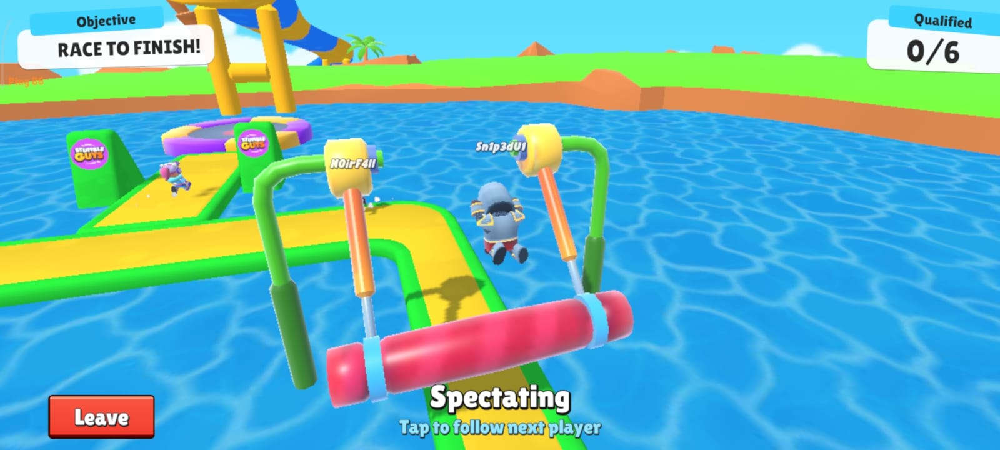
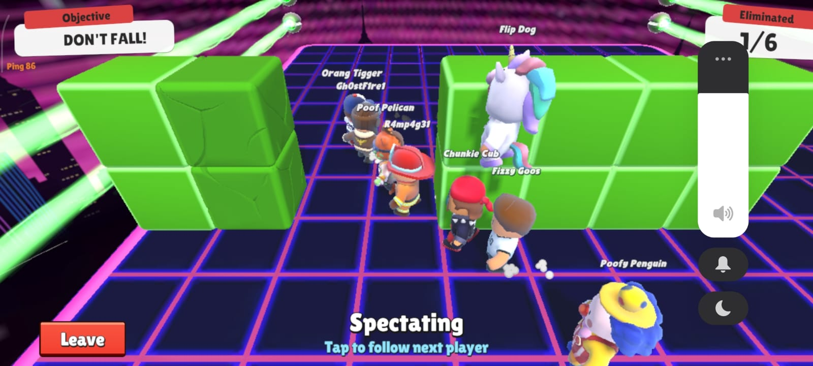
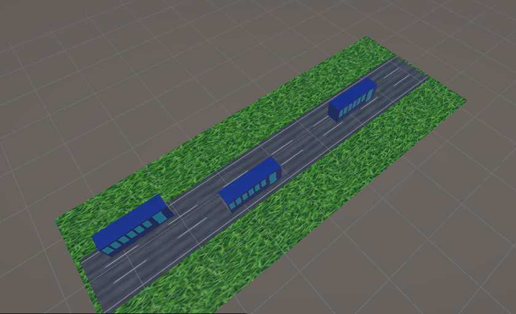
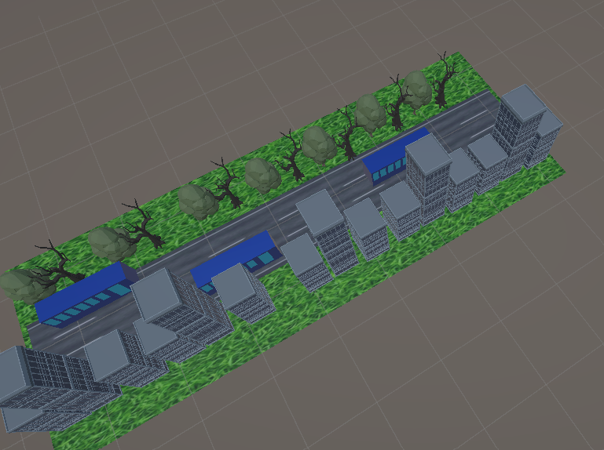
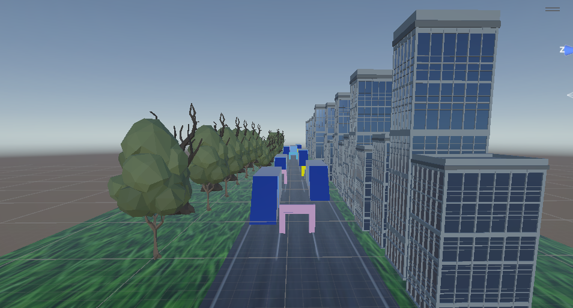
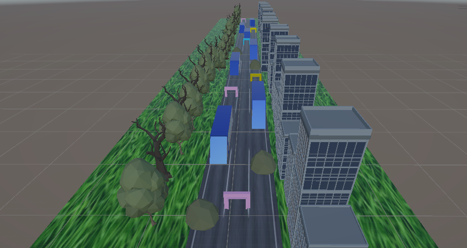

# CS464 Assignment 01 · [SABAHAT HAMZA] · [BSCS25105]

## Game 1 · Robbery Bob

- **Store link:** https://play.google.com/store/apps/details?id=com.chillingo.robberybobfree.android.row
- **Genre:** Stealth puzzle
- **I played:** 45 minutes, up to level 3

1. M1, M3 · A guard patrols along a dotted path with a yellow vision cone, while a chest marker above the couch shows loot Bob can steal.
2. M1, M3 · Bob picks up a "Ball of Yarn" in one room, while the next room has a guard's patrol path and vision cone at the edge of the screen.
3. M3, M6 · Bob starts in the garden outside the house, and the boss warns him that empty boxes won't repay his debt.

| # | Mechanic | Dynamic | Aesthetic | Bartle type |
|---|---|---|---|---|
| M1 | A guard, dog or camera that sees Bob catches him, and the level restarts. | Players study each guard's patrol and wait in cover for the right gap before moving. | Challenge: one mistake fails the level, so slipping past feels earned. | Achiever: beating each level on its own terms. |
| M2 | Bob can hide in spots such as bushes and behind objects, out of sight. | Players hop from one hiding spot to the next and time their dashes between them. | Challenge: planning a safe route under pressure. | Achiever: solving the level cleanly. |
| M3 | Each level has valuables placed around it, and picking them up adds to Bob's cash. | Players take detours into guarded rooms to grab extra loot, or skip it to stay safe. | Challenge: greed is a risk you choose to take. | Achiever: collecting everything. |
| M4 | Cash earned is spent in a shop on outfits and gadgets. | Players replay levels to afford the item they want, and pick outfits for how Bob looks. | Expression: making Bob look the way you want. | Explorer: trying out what each item does. |
| M5 | Levels unlock in order, and each new one adds new guards or hazards. | Players keep going to see the next trick the game throws at them. | Discovery: each level shows a new situation to figure out. | Explorer: finding out how new hazards work. |
| M6 | A level ends only when Bob reaches its exit after the objective is done. | Players plan the whole route backwards from the exit before they start moving. | Challenge: a clear goal with obstacles in between. | Achiever: finishing the objective. |
| M7 | The game offers extra rewards or a retry in exchange for watching an ad. | Players choose whether to watch an ad when stuck or short on cash. | Submission: short sessions that fit idle time. | Achiever: the reward pushes progress forward. |

**Aesthetic profile:** Challenge leads (M1, M2, M3, M6): every level can be failed in one hit, so success feels earned. Discovery (M5) keeps players moving on, and Expression (M4) gives cash a personal use.

**Player types**
- Primary: Achiever (acting × world), because M1, M3 and M6 each give the player a goal to beat on the game's own terms: the player acts on the level to finish it and grab loot, with no other players involved.
- Secondary: Explorer (interacting × world), because M4 and M5 reward engaging with the game system itself: trying new items and working out how new hazards behave, rather than imposing on it.

## Game 2 · Stumble Guys

- **Store link:** https://play.google.com/store/apps/details?id=com.kitkagames.fallbuddies
- **Genre:** Multiplayer party race / battle royale
- **I played:**  40 minutes, 3 matches, reached the final 1 times

1. M1, M3 · The player has been knocked out and is spectating, while others cross a narrow bridge with a swinging roller over water; only 6 players can qualify.
2. M1 · The start of a round with 12 qualifying spots, a countdown timer running, and the joystick and jump controls on screen.
3. M2, M4 · In a "Don't Fall!" round, a crowd of players squeezes between the green blocks on the platform; 1 of 6 elimination spots is already filled and the player is spectating.

| # | Mechanic | Dynamic | Aesthetic | Bartle type |
|---|---|---|---|---|
| M1 | Only a fixed number of players qualify from each round, and the rest are eliminated. | Players sprint and cut corners near the end, because the last few spots decide who stays. | Challenge: every round can end your run. | Achiever: pushing deeper into the tournament. |
| M2 | Characters collide, and a dive or bump knocks others off balance. | Players shove rivals near edges and dive at the leaders to slow them down. | Challenge: rivals are your main obstacle. | Killer: your win costs another player. |
| M3 | Each course has moving obstacles such as spinners, hammers and gaps. | Players watch the pattern, wait for the gap, then commit to the run. | Challenge: timing a path through hazards. | Achiever: clearing the course. |
| M4 | In a "Don't Fall!" round, a player who falls off the platform is eliminated, and the screen counts how many have been eliminated. | Players avoid the edges and crowded gaps, and try to stay on the platform while others fall around them. | Challenge: one slip ends your round. | Achiever: surviving the round. |
| M5 | Each match chains several rounds, ending in a final where one player wins. | Players pace themselves early and save their push for the later rounds. | Challenge: one winner, so only the best run counts. | Achiever: winning the whole match. |
| M6 | Coins or gems buy skins and emotes for your character. | Players spend currency on a look or emote that shows off who they are in the lobby. | Expression: choosing how your character appears. | Socializer: the look is for other players to see. |
| M7 | Players can form a party and queue into the same match with friends. | Friends join the same match, joke around, and cheer or tease each other mid-race. | Fellowship: playing and laughing together. | Socializer: the game is a place to be with friends. |

**Aesthetic profile:** Challenge leads (M1 to M5): every round can eliminate you. Expression (M6) lets players show personality through skins, and Fellowship (M7) makes the chaos more fun with friends.

## Level blockouts

| Level | Screenshot | Its idea | Wayfinding tool |
|---|---|---|---|
| Level01 |  | A basic straight road with a train in the lane: the core run from spawn to goal. | Leading lines: the road's lane lines point the player toward the goal. |
| Level02 |  | Trains placed far down the road, with buildings and trees added on both sides to build an environment. | Framing: the buildings and trees on both sides frame the road ahead. |
| Level03 |  | Obstacle gates across the lanes, and a slope on a train that the player has to climb. | Landmark: the coloured gates stand out and can be seen from far away. |
| Level04 |  | Bushes placed along and inside the lanes, which narrow the path. | Pinch and release: the bushes squeeze the path, then it opens up again. |

**Player types**
- Primary: Achiever (acting × world), because M1, M3, M4 and M5 push the player to clear courses and survive rounds on the game's own terms: the player acts on the game's system to qualify and win, rather than just exploring how it works.
- Secondary: Killer (acting × players), because M2 lets players shove and dive at each other, so one player's progress can cost another player a qualifying spot.
